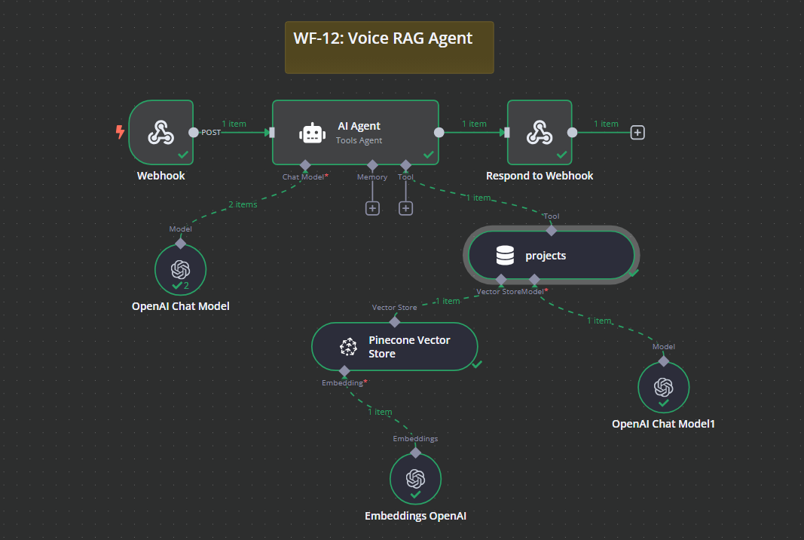

# WF-12: Voice RAG Agent – n8n Workflow

## 📌 Overview
This **n8n workflow**, `WF-12: Voice RAG Agent`, acts as an AI-powered **retrieval-augmented generation (RAG) assistant**, designed to process incoming queries via a webhook, retrieve relevant information using a vector database, and generate AI-powered responses.

## 🔧 Workflow Components
### 🏗️ Core Modules
1. **🌐 Webhook** – Listens for incoming POST requests with user queries.
2. **🤖 AI Agent** – Processes the query and determines the appropriate response.
3. **📚 Pinecone Vector Store** – Retrieves relevant project-related data from a vector database.
4. **📝 OpenAI Chat Model** – Generates AI-powered responses based on retrieved data.
5. **🔍 Embeddings OpenAI** – Converts text into vector embeddings for efficient information retrieval.
6. **🛠️ Project Retrieval Tool** – Provides structured responses about stored projects.
7. **🔄 Respond to Webhook** – Returns the AI-generated response to the original requester.

## ⚙️ How It Works
1. 🌐 A **POST request** containing a user’s question is sent to the **Webhook**.
2. 🤖 The **AI Agent** processes the query and checks if relevant project information is needed.
3. 🔍 If the query requires past project details, the **Pinecone Vector Store** retrieves relevant records.
4. 📝 The **OpenAI Chat Model** generates an intelligent response based on retrieved data and user input.
5. 🔄 The **Respond to Webhook** node sends the response back to the requester.

## 📷 Workflow Screenshot

## 🚀 Setup Instructions
- 📥 **Import the workflow** into `n8n`.
- 🔑 **Ensure API credentials** for OpenAI, Pinecone, and Webhooks are configured.
- ✅ **Activate the workflow** to start processing AI-powered responses.

## 📝 Notes
- ⚠️ The workflow is **inactive by default**.
- 🛠️ Modify the AI prompt and Pinecone index settings for better retrieval accuracy.
- 💡 Suitable for **chatbots, customer support agents, and automated research assistants**.
